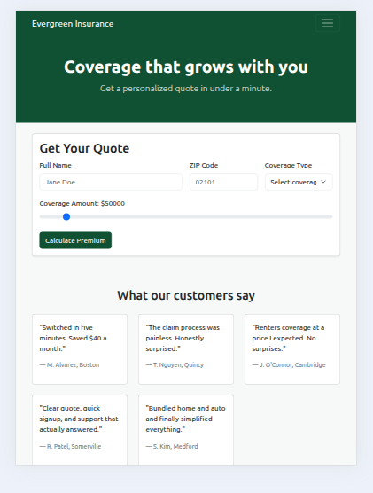

# Delivery Review — Evergreen Quote

## Slide 1 — Delivery goal & did we hit it?

- Goal: By Thursday EOD, an assembled, themed, responsive Evergreen Quote app with the wired quote calculator is merged to main via a reviewed PR with a green CI run.
- Hit? X Yes  ☐ Partially  ☐ No
- Site is built, with ability to dynamic resize for any device.  Functionality to provide quotes passed all tests, and PR merged without issues during CI run.

## Slide 2 — What shipped

- 
- Merged PR: https://github.com/asc1-student07/evergreen-quote-delivery/pull/9
- CI Run: https://github.com/asc1-student07/evergreen-quote-delivery/actions/runs/29501254204

## Slide 3 — Two key decisions

## Context

-Decision Tradeoff: Legal was delayed in getting signoff for posting testimonials

- Options considered

- **Option A — Hide testimonials with d-none.** quick / still viewable in source
- **Option B — Remove testimonials from html source.** no way for users to view / slow to restore

> Team chose to remove source altogether, since savvy web users would still be able to see the source with a simple "view source" in any browser.

## Slide 4 — Risks & injects

Top risk we tracked:

| # | Risk | Owner | Likelihood (L/M/H) | Impact (L/M/H) | Mitigation | Trigger to escalate |
|---|---|---|---|---|---|---|
| R1 | css conflicts with Bootstrap | Marc | M | M | test all sizes regularly, order html correctly | layout still broken end of Day 2 |
| R2 | wrong calculation results | Marc | L | M | Test all scenarios | issues exist end of day 3 |
| R3 | branding is off | Marc | M | L | visual inspection | issues exist end of day 2 |
| R4 | testimonials are legally allowed to be displayed | Marc | H | L | Decision on whether to hide or remove content from main page | no decision by 10am Day 3 |
| R5 | CI/CD Pipeline or deployent fails | Marc | L | M | Use automated build/test checks | failed smoke testing |

- Inject #1 (Tue): Legal Hold on Testimonials, Addition of Compare Plans
> Was able to easily adjust testimonials to protect Evergreen while legal activities complete
> Created project cards for compare plans, Since page content existed, we didn't see this as an issue to add to the site.  Timeline would be minimally affected. End results was that we didn't ship this
- Inject #2 (Wed): Premium Calculation Error
> Users reported massive calc errors for renters
> troubleshooting found missing renters javascript file, which corrected issues

## Slide 5 — What I'd do differently next round

- More detailed test plan to have better coverage of all calculation scenarios, to better protect against escaped bugs.
- Improved stakeholder management.  Formalize signoffs with stakeholders to try to reduce scope creep (such as the Compare Plans request)
- Add minimal backend.  Collecting user contact and quoted information add value to Evergreen sales prospecting team.
